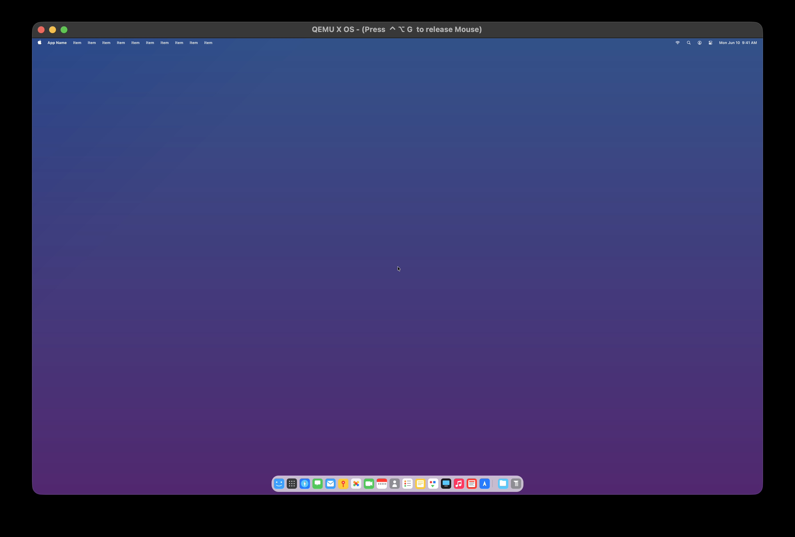

# X OS

A clean-slate x86_64 microkernel operating system built from scratch. No POSIX baggage, no legacy Unix assumptions. The kernel stays minimal: scheduling, memory management, IPC ports, and hardware abstraction. Everything else (display server, filesystem, shell) lives in ring-3 userspace and communicates over message passing.



*X OS running in QEMU with GPU-accelerated rendering — menu bar, dock with app icons, and compositor surfaces at 2560×1600.*

## What It Is

X OS is a microkernel designed for the AI era. No decades of compatibility debt, no legacy Unix assumptions, no POSIX baggage. The goal is an operating system that feels native to intelligent agents and human users alike: beautiful, consistent, and fully open to modification.

- **Microkernel architecture** — the kernel provides ~33 syscalls. Filesystem access, GPU rendering, and input handling are delegated to ring-3 services that talk over IPC ports.
- **No POSIX / no Unix ABI** — this is not Linux, BSD, or anything derived from them. The syscall surface is deliberately minimal.
- **Embedded userspace** — the init process and display server (composer) are compiled as ELF binaries, then embedded directly into the kernel image as byte arrays. The kernel spawns them at boot.
- **Display server in userspace** — a hardware-accelerated composer runs in ring 3, receiving surface commands from applications via IPC and flushing to a virtio-gpu framebuffer.

## Vision

This is not a retro hobby OS. The goal is a forward-looking system where the boundary between user and developer disappears.

### App Bundles with Source
Applications ship as bundles. In many cases the source code is included directly in the bundle. Open any app, read how it works, modify it, and run your version immediately. Software on X OS is meant to be read, understood, and changed.

### Controlled User Customization
Users have absolute control over the look and feel of the system, but within guardrails that preserve beauty and consistency. A user-space `xui.plist` file lets you tune animations, transitions, spacing, and behavior. You can make it yours without turning the desktop into a Frankenstein. The system enforces visual coherence — customization, not chaos.

### Live Programming
Eventually, X OS will host a real-time programming environment. You edit code and see the result immediately, with no compile-wait-run loop. Changes propagate live into running processes. This is the natural endpoint of a microkernel built on IPC and dynamic surface composition: the entire system is designed to be modified while it runs.

## Architecture Overview

| Component | Ring | Responsibility |
|-----------|------|----------------|
| Kernel | 0 | Scheduling, memory alloc/map, IPC ports, timer, interrupts, NVMe/virtio drivers |
| Init (PID 1) | 3 | First userspace process; spawns services and registers well-known nameserver ports |
| Composer | 3 | Display server — surfaces, dirty rectangles, cursor, desktop background |
| Menu Bar | 3 | Top panel — X logo, app name, menus, dropdowns, focus tracking |
| Dock | 3 | Bottom panel — app icons, hover effects, spawn/hide/show/close |
| Xplorer | 3 | File manager app — draggable window, hide/show support |
| Future: Terminal, Shell, FS service | 3 | Will run as normal ring-3 processes using IPC |

## Requirements (macOS)

Tested on macOS with Apple Silicon. You need:

- **Xcode Command Line Tools** (provides `clang`, `make`, `git`)
  ```
  xcode-select --install
  ```

- **Homebrew** — https://brew.sh

- **lld** (LLVM linker)
  ```
  brew install lld
  ```

- **xorriso** (for building the bootable ISO)
  ```
  brew install xorriso
  ```

- **QEMU** — install via Homebrew or build from source. The Makefile auto-detects the path.

  Option A — Homebrew (quickest):
  ```
  brew install qemu
  ```

  Option B — build latest from source into `/opt/qemu-head`:
  ```
  git clone https://gitlab.com/qemu-project/qemu.git
  cd qemu
  mkdir build && cd build
  ../configure --prefix=/opt/qemu-head --target-list=x86_64-softmmu \
    --enable-virtiofsd --enable-spice --enable-cocoa
  make -j$(sysctl -n hw.ncpu)
  sudo make install
  ```

  The Makefile checks `/opt/qemu-head` first, then the Homebrew prefix, then falls back to `qemu-system-x86_64` in your PATH.

## Build

One-time setup (downloads the Limine bootloader):

```
make setup
```

Build the bootable ISO:

```
make
```

This produces `x-os.iso` in the project root.

## Run

BIOS mode (SeaBIOS):

```
make run
```

UEFI mode (OVMF):

```
make run-uefi
```

QEMU is launched with:
- Machine: `q35`
- 512 MB RAM, 1 SMP
- virtio-gpu-pci at 2560x1600, Cocoa display
- NVMe disk (`disk.img`, created automatically if missing)
- Serial output forwarded to stdio

## Project Layout

```
x/
├── boot/           # Limine bootloader config and handoff structures
├── kernel/         # Microkernel source
│   ├── arch/x86_64/   # GDT, IDT, syscall entry, context switch
│   ├── memory/        # Physical page allocator, VMM, heap
│   ├── sched/         # Round-robin scheduler
│   ├── ipc/           # Port-based message passing
│   ├── proc/          # ELF loader; init and composer blobs
│   ├── hal/           # NVMe, virtio GPU, PS/2 input, PCI, timers
│   ├── fs/            # Custom XFS filesystem
│   └── entry/         # kmain() boot sequence
├── userspace/      # Ring-3 code
│   ├── init/          # PID 1
│   ├── runtime/       # Syscall wrappers (shared C library)
│   ├── lib/
│   │   └── xgfx/      # Graphics library (paths, fills, text, scaled text)
│   └── services/
│       ├── composer/  # Display server
│       ├── dock/      # Bottom dock panel
│       ├── menubar/   # Top menu bar panel
│       └── xplorer/   # File manager app
├── Makefile
└── disk.img        # Raw 4 MiB block device image (auto-created)
```

## Cleaning Up

```
make clean       # remove build artifacts and ISO
make distclean   # also remove the fetched Limine directory
```

## License

Business Source License 1.1

X OS is source-available under the BSL. This means:

- **Free for contributors** — you can fork, modify, build, and send pull requests.
- **Free for personal, educational, and research use.**
- **Commercial use requires a paid license** — if you want to sell it, offer it as a service, or embed it in a product, contact the copyright holder.
- **All commercial rights reserved** — the copyright holder controls all commercial licensing and may grant or deny commercial use at their sole discretion.

This model lets the community grow the project while keeping all commercial and acquisition paths fully controlled by the copyright holder. See [LICENSE](LICENSE) for full terms.

For commercial licensing, partnership, or acquisition inquiries, contact the copyright holder.
