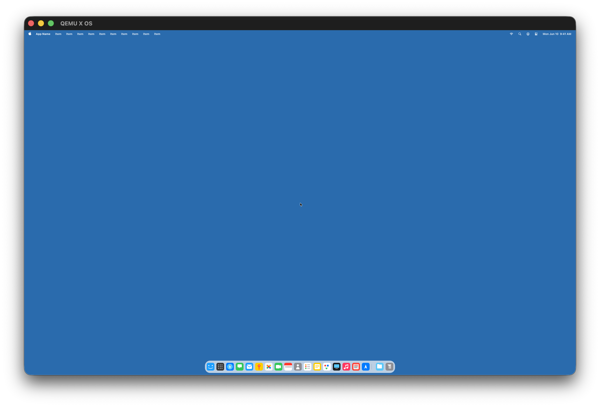

# X OS

**A forward-looking operating system built from scratch for the AI era.**

Not Linux. Not FreeBSD. Not Windows. Not macOS. These operating systems were designed decades ago for a world of human-only users, carrying layers of backwards compatibility that constrain what's possible. X OS is a clean-slate microkernel that asks a different question: *what would an OS look like if it were designed today — for intelligent agents and human users alike?*



*X OS running in QEMU with GPU-accelerated rendering — menu bar, dock with app icons, compositor surfaces, and desktop at 2560×1600.*

---

## Why

Every mainstream operating system is burdened by decades of legacy. POSIX, the Unix ABI, Win32 — these are anchors, not foundations. They exist to preserve compatibility with software written 30+ years ago. That debt makes it nearly impossible to rethink fundamental assumptions about how users (human or AI) interact with a computer.

X OS starts from zero. The kernel provides the bare minimum — scheduling, memory, IPC, hardware drivers. Everything else is a userspace service that can be inspected, modified, or replaced without touching the kernel. No decades-old ABI to maintain. No legacy cruft. Just a clean foundation for what comes next.

### Principles

- **Minimal backwards compatibility** — the past is not the priority. The system is designed for what's ahead, not what came before.
- **AI-native, not AI-bolted-on** — the architecture assumes that both humans and intelligent agents are first-class users of the OS.
- **Everything is inspectable and mutable** — services run in ring 3, communicate over IPC, and can be modified while the system runs.
- **Beautiful by default** — the UI is consistent, polished, and coherent. Customization is encouraged within guardrails that prevent chaos.
- **Microkernel, not monolith** — the kernel stays tiny. Display, filesystem, networking, shell — all are userspace processes.

---

## Vision & Evolution

The core idea of X OS is fixed: **a forward-looking operating system built for the AI era, designed for agentic workflows and intelligent users.** That will not change.

How we get there — the architecture, the UI, the technologies we choose, what we prioritize — will absolutely change. As contributors and great minds join the project, the system will evolve in ways no single person can predict. Design decisions made today may be revised tomorrow. Components may be rewritten, replaced, or removed. That's not a risk; that's the point. A system built for the future must be willing to change.

What stays constant is the rejection of legacy-for-its-own-sake. We are not maintaining compatibility with the past. We are building for what's next.

The desktop environment aims to feel familiar — a menu bar, a dock, windows, a cursor. We lean into known desktop conventions because they work and users already understand them. That said, this is not a commitment. If we discover something fundamentally better, we will explore it. The goal is not to copy any existing OS, but to provide an interface that is intuitive today and open to reinvention tomorrow.

---

## What Exists Today

X OS boots on real hardware (via Limine) and in QEMU, with a working desktop environment:

- **Microkernel** — ~90 syscalls covering scheduling, memory management, IPC ports, timers, GPU/virtio drivers, NVMe storage, and networking
- **Userspace composer** — hardware-accelerated display server with surface compositing, dirty rectangles, window decorations, cursor management, and GPU rendering via virgl (OpenGL ES)
- **Menu bar** — top panel with app menus, dropdowns, and focus tracking
- **Dock** — bottom panel with app icons, hover effects, and app launch/close
- **Context menu** — right-click popup service powered by egui (Rust, `no_std`)
- **Shell** — embedded zsh port running as a userspace process
- **File manager** (Xplorer) — draggable window app
- **Networking** — XNU BSD network stack ported to the microkernel: TCP/UDP sockets, virtio-net driver, POSIX socket API
- **Filesystem** — custom XFS filesystem with NVMe block device support
- **GPU acceleration** — virtio-gpu with virglrenderer for OpenGL ES 3D compositing; custom GPU command stream for textured quad rendering with alpha blending
- **egui integration** — egui 0.35 ported to `no_std`/`x86_64-unknown-none` with a custom CPU rasterizer (scanline glyph renderer) and software backend for immediate-mode UI rendering

---

## Architecture

| Component | Ring | Responsibility |
|-----------|------|----------------|
| **Kernel** | 0 | Scheduling, memory alloc/map, IPC ports, timer, interrupts, NVMe, virtio GPU, virtio-net, PCI |
| **Init** (PID 1) | 3 | First userspace process; spawns services, registers nameserver ports |
| **Composer** | 3 | Display server — surfaces, dirty rects, window decorations, cursor, GPU compositing |
| **Menu Bar** | 3 | Top panel — X logo, app menus, dropdowns, focus tracking |
| **Dock** | 3 | Bottom panel — app icons, hover effects, spawn/hide/show/close |
| **Context Menu** | 3 | Right-click popup — egui-based, Rust `no_std` staticlib |
| **Shell** | 3 | zsh port — runs as a userspace process |
| **Xplorer** | 3 | File manager — draggable window |
| **BSD Layer** | 0→3 | XNU BSD networking stack (sockets, TCP/IP, virtio-net) adapted for the microkernel |

### How It Works

The kernel is a minimal microkernel: it handles CPU scheduling, physical/virtual memory, IPC message ports, and hardware drivers (NVMe, virtio-gpu, virtio-net, PS/2 input, PCI, timers). It does **not** contain filesystem code, display logic, or networking — those are userspace services.

All userspace binaries (init, composer, dock, menubar, menu, shell) are compiled as ELF binaries and **embedded directly into the kernel image** as byte arrays. The kernel spawns them at boot — no disk loading, no bootloader chain for userspace.

Services communicate via IPC ports. The composer registers a well-known port; apps send surface creation requests, dirty rectangles, and mouse events over IPC. The nameserver (`sys_ns_register` / `sys_ns_lookup`) provides service discovery.

GPU compositing uses virgl (OpenGL ES via virtio-gpu 3D). Each app surface gets a GPU texture; the composer submits a 3D command stream that draws textured quads with alpha blending onto a framebuffer-backed render target that is also the scanout source.

---

## Requirements (macOS)

Tested on macOS with Apple Silicon. You need:

- **Xcode Command Line Tools** (provides `clang`, `make`, `git`)
  ```
  xcode-select --install
  ```

- **Homebrew** — https://brew.sh

- **lld** (LLVM linker)
  ```
  brew install lld
  ```

- **xorriso** (for building the bootable ISO)
  ```
  brew install xorriso
  ```

- **QEMU** — install via Homebrew or build from source. The Makefile auto-detects the path.

  Option A — Homebrew (quickest):
  ```
  brew install qemu
  ```

  Option B — build QEMU v11 from source with virgl/ANGLE GPU rendering (recommended for GPU acceleration on Apple Silicon):
  ```
  # Install the startergo tap for virgl/ANGLE dependencies
  brew tap startergo/homebrew-qemu-virgl
  brew trust startergo/qemu-virgl
  brew install libangle libepoxy-angle virglrenderer spice-protocol spice-server \
    meson ninja glib pixman pkg-config dtc vde libssh

  # Build QEMU v11.0.2 with Cocoa + virgl + OpenGL ES
  bash tools/build-qemu-virgl.sh
  ```

  This builds QEMU v11.0.2 with `virtio-gpu-gl-pci` support, Cocoa display, and OpenGL ES rendering via ANGLE/virglrenderer. The script handles patching, building, installing to `/opt/qemu-head`, fixing dylib paths, and code-signing with HVF entitlements.

  The Makefile checks `/opt/qemu-head` first, then the Homebrew `qemu-virgl` prefix, then the Homebrew `qemu` prefix, then falls back to `qemu-system-x86_64` in your PATH.

---

## Build

One-time setup (downloads the Limine bootloader):

```
make setup
```

Build the bootable ISO:

```
make
```

This produces `x-os.iso` in the project root.

## Run

BIOS mode (SeaBIOS):

```
make run
```

UEFI mode (OVMF):

```
make run-uefi
```

QEMU is launched with:
- Machine: `q35`
- 512 MB RAM, 1 SMP
- virtio-gpu-pci at 2560x1600, Cocoa display
- NVMe disk (`disk.img`, created automatically if missing)
- Serial output forwarded to stdio

---

## Project Layout

```
x/
├── boot/               # Limine bootloader config and handoff structures
├── kernel/             # Microkernel source
│   ├── arch/x86_64/       # GDT, IDT, syscall entry, context switch
│   ├── memory/            # Physical page allocator, VMM, heap
│   ├── sched/             # Round-robin scheduler
│   ├── ipc/               # Port-based message passing
│   ├── proc/              # ELF loader; embedded userspace blobs
│   ├── hal/               # NVMe, virtio GPU, virtio-net, PS/2 input, PCI, timers
│   ├── fs/                # Custom XFS filesystem
│   ├── bsd/               # XNU BSD syscall implementations (sockets, fork, exec, pipe)
│   └── entry/             # kmain() boot sequence
├── bsd/                # XNU BSD networking stack (TCP/IP, sockets, virtio-net)
├── userspace/          # Ring-3 code
│   ├── init/              # PID 1
│   ├── runtime/           # Syscall wrappers (shared C library)
│   ├── shell/             # zsh port
│   ├── lib/
│   │   ├── xgfx/          # Graphics library (paths, fills, text, scaled text)
│   │   ├── thorvg/        # ThorVG vector graphics engine (SVG rendering)
│   │   ├── wm/            # Window manager IPC protocol library
│   │   └── cpp_runtime/   # C++ runtime support for freestanding environment
│   └── services/
│       ├── composer/      # Display server + GPU compositing
│       ├── dock/          # Bottom dock panel
│       ├── menubar/       # Top menu bar panel
│       ├── menu/          # Right-click context menu (egui, Rust no_std)
│       └── xplorer/       # File manager app
├── third_party/       # Vendored dependencies
│   ├── egui/              # egui 0.35 (ported to no_std/x86_64-unknown-none)
│   ├── egui_software_backend/  # CPU rasterizer for egui primitives
│   └── llvm-project-libcxx/    # libc++ for freestanding C++ runtime
├── tools/             # Build scripts (QEMU virgl build, etc.)
├── Makefile
└── disk.img           # Raw block device image (auto-created)
```

---

## Cleaning Up

```
make clean       # remove build artifacts and ISO
make distclean   # also remove fetched Limine directory
```

---

## License

Business Source License 1.1

X OS is source-available under the BSL. This means:

- **Free for contributors** — you can fork, modify, build, and send pull requests.
- **Free for personal, educational, and research use.**
- **Commercial use requires a paid license** — if you want to sell it, offer it as a service, or embed it in a product, contact the copyright holder.
- **All commercial rights reserved** — the copyright holder controls all commercial licensing and may grant or deny commercial use at their sole discretion.

This model lets the community grow the project while keeping all commercial and acquisition paths fully controlled by the copyright holder. See [LICENSE](LICENSE) for full terms.

For commercial licensing, partnership, or acquisition inquiries, contact the copyright holder.
